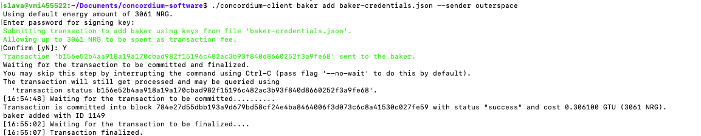

1. submit baker ID: 1149

2. submit screenshot for client registration command:

3. submit account address: 4rov1pw3RbYukW2eRtWp4pY9GADu86dLexMpEm146meAgT7x5Y

4. submit transaction ID of the transaction used to register as a baker: b156e52b4aa918a19a170cbad982f15196c482ac3b93f840d8660252f3a9fe68

5. submit blockhash of at least one block you produced: 8c2141d10faeed15828e52b6cc981497c389b2e676424497ac51c801ca5231aa

6. submit transaction ID of the transaction that changes the reward account: 2d0d8985d9119b5c05b0f8ab25e33085d6dfe59082829e1d974436ea1ff6cef4

7. submit transaction ID of the transaction that updated baker's keys: c26fe3bae4ff4acef529ccc0cc25de7f3a1775bba3fb6a906bc2332c08744151
