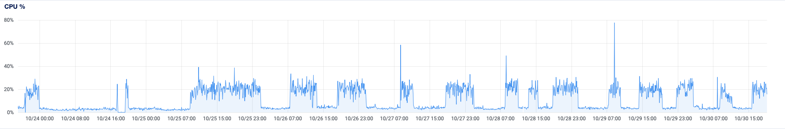
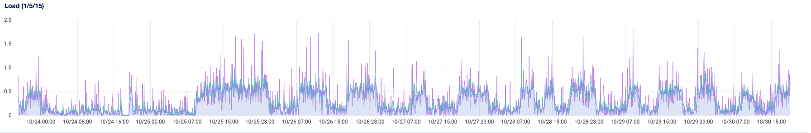
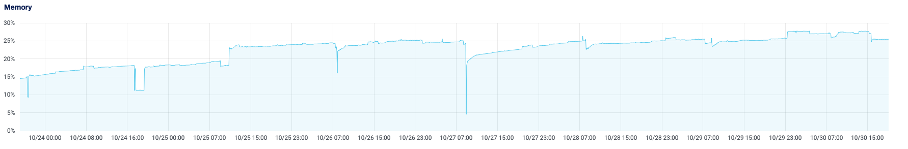
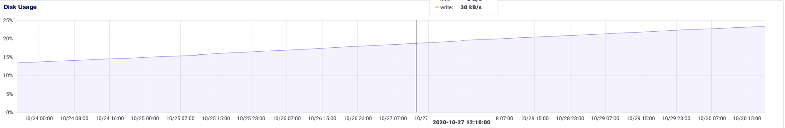
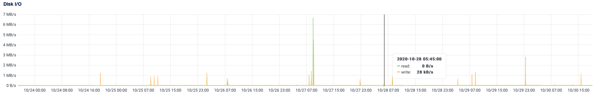
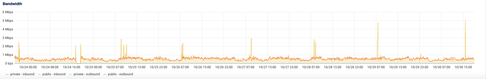

* submit node ID

f75f2d5c7a32286d

*submit machine specs
```javascript
ubuntu-concordium           
    description: Computer
    product: Droplet
    vendor: DigitalOcean
    version: 20171212
    serial: 212208416
    width: 64 bits
    capabilities: smbios-2.4 dmi-2.4 smp vsyscall32
    configuration: boot=normal family=DigitalOcean_Droplet uuid=999F75BA-DE5C-4F70-A973-3638590C5CB2
  *-core
       description: Motherboard
       physical id: 0
     *-firmware
          description: BIOS
          vendor: DigitalOcean
          physical id: 0
          version: 20171212
          date: 12/12/2017
          size: 96KiB
     *-cpu:0
          description: CPU
          product: Intel(R) Xeon(R) Gold 6140 CPU @ 2.30GHz
          vendor: Intel Corp.
          physical id: 401
          bus info: cpu@0
          slot: CPU 1
          size: 2GHz
          capacity: 2GHz
          width: 64 bits
          capabilities: fpu fpu_exception wp vme de pse tsc msr pae mce cx8 apic sep mtrr pge mca cmov pat pse36 clflush mmx fxsr sse sse2 ss syscall nx pdpe1gb rdtscp x86-64 constant_tsc arch_perfmon rep_good nopl cpuid tsc_known_freq pni pclmulqdq vmx ssse3 fma cx16 pcid sse4_1 sse4_2 x2apic movbe popcnt tsc_deadline_timer aes xsave avx f16c rdrand hypervisor lahf_lm abm 3dnowprefetch cpuid_fault invpcid_single pti ssbd ibrs ibpb tpr_shadow vnmi flexpriority ept vpid ept_ad fsgsbase tsc_adjust bmi1 avx2 smep bmi2 erms invpcid mpx avx512f avx512dq rdseed adx smap clflushopt clwb avx512cd avx512bw avx512vl xsaveopt xsavec xgetbv1 pku ospke md_clear
     *-cpu:1
          description: CPU
          product: Intel(R) Xeon(R) Gold 6140 CPU @ 2.30GHz
          vendor: Intel Corp.
          physical id: 402
          bus info: cpu@1
          slot: CPU 2
          size: 2GHz
          capacity: 2GHz
          width: 64 bits
          capabilities: fpu fpu_exception wp vme de pse tsc msr pae mce cx8 apic sep mtrr pge mca cmov pat pse36 clflush mmx fxsr sse sse2 ss syscall nx pdpe1gb rdtscp x86-64 constant_tsc arch_perfmon rep_good nopl cpuid tsc_known_freq pni pclmulqdq vmx ssse3 fma cx16 pcid sse4_1 sse4_2 x2apic movbe popcnt tsc_deadline_timer aes xsave avx f16c rdrand hypervisor lahf_lm abm 3dnowprefetch cpuid_fault invpcid_single pti ssbd ibrs ibpb tpr_shadow vnmi flexpriority ept vpid ept_ad fsgsbase tsc_adjust bmi1 avx2 smep bmi2 erms invpcid mpx avx512f avx512dq rdseed adx smap clflushopt clwb avx512cd avx512bw avx512vl xsaveopt xsavec xgetbv1 pku ospke md_clear
     *-memory
          description: System Memory
          physical id: 1000
          size: 4GiB
          capabilities: ecc
          configuration: errordetection=multi-bit-ecc
        *-bank
             description: DIMM RAM
             physical id: 0
             slot: DIMM 0
             size: 4GiB
             width: 64 bits
           *-virtio3
                description: Virtual I/O device
                physical id: 0
                bus info: virtio@3
                logical name: /dev/vda
                size: 80GiB (85GB)
                capabilities: gpt-1.00 partitioned partitioned:gpt
                configuration: driver=virtio_blk guid=2ed04d82-ba1d-4a75-86b9-9553b7ea5228 logicalsectorsize=512 sectorsize=512
              *-volume:0
                   description: EXT4 volume
                   vendor: Linux
                   physical id: 1
                   bus info: virtio@3,1
                   logical name: /dev/vda1
                   logical name: /
                   version: 1.0
                   serial: 1372ed12-1a50-4521-a6b8-7b90c34cfb09
                   size: 79GiB
                   capacity: 79GiB
                   capabilities: journaled extended_attributes large_files huge_files dir_nlink recover 64bit extents ext4 ext2 initialized
                   configuration: created=2020-09-02 21:45:03 filesystem=ext4 label=cloudimg-rootfs lastmountpoint=/ modified=2020-10-15 08:13:30 mount.fstype=ext4 mount.options=rw,relatime mounted=2020-10-27 07:53:54 state=mounted
              *-volume:1
                   description: BIOS Boot partition
                   vendor: EFI
                   physical id: e
                   bus info: virtio@3,14
                   logical name: /dev/vda14
                   serial: 3e848af9-ad2c-4825-a39b-c0134fe7e5bf
                   capacity: 4095KiB
                   capabilities: nofs
              *-volume:2
                   description: Windows FAT volume
                   vendor: mkfs.fat
                   physical id: f
                   bus info: virtio@3,15
                   logical name: /dev/vda15
                   logical name: /boot/efi
                   version: FAT32
                   serial: 272a-a2d2
                   size: 105MiB
                   capacity: 105MiB
                   capabilities: fat initialized
                   configuration: FATs=2 filesystem=fat label=UEFI mount.fstype=vfat mount.options=rw,relatime,fmask=0022,dmask=0022,codepage=437,iocharset=iso8859-1,shortname=mixed,errors=remount-ro state=mounted
```
*provide feedback on RAM and disk usage and expectations

The disc usage has increased by 10% in 7 days, the same has happened with RAM. No memory leaks were observed. Every time the node restarts, there are short peaks in CPU usage, disk writing and bandwith usage. The VPS used for the challenge is not that powerful, 4 Gb RAM / 2 shared vCPUs, however Concordium node and client are not resource heavy, so it was more than enough.
No other node was running on the VPS during the challenge.
Below are some graphs available:













