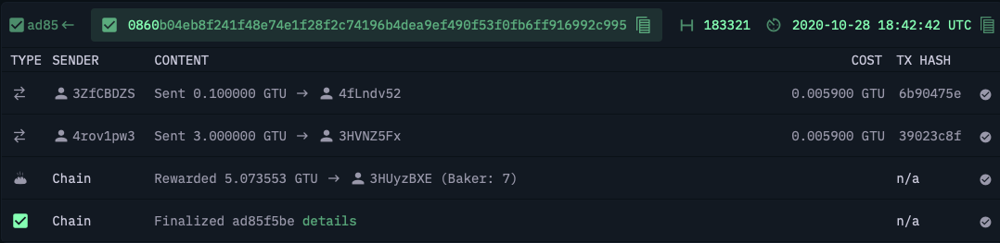
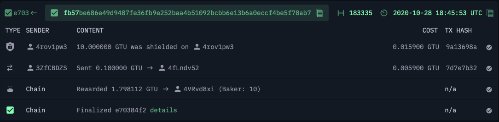
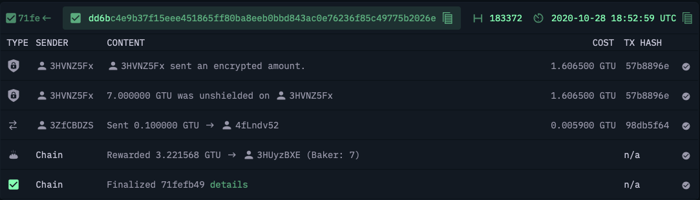

Addresses: 
 A: 4rov1pw3RbYukW2eRtWp4pY9GADu86dLexMpEm146meAgT7x5Y
 B: 3HVNZ5FxukbT1pc5EsuaAGdnKBKRkUbvz2yMsnLjyv9egrADHK

 Device: iPhone 6s, MKR42LL/A
 Software: iOS 14.1
 
 *transfer 3 GTU from account A to account B:
 
 
 *shield 10 GTU of account A
 
 
 *transfer 7 GTU from the shielded balance on account A to B
 
 
 *unshield shielded balance on account B
 
